---
## Front matter
title: "Шаблон отчёта по лабораторной работе 1"
subtitle: "Целью данной работы является приобретение практических навыков уста-
новки операционной системы на виртуальную машину, настройки минимально
необходимых для дальнейшей работы сервисов."
author: "Сильвен Макс Грегор Филс"

## Generic otions
lang: ru-RU
toc-title: "Содержание"

## Bibliography
bibliography: bib/cite.bib
csl: pandoc/csl/gost-r-7-0-5-2008-numeric.csl

## Pdf output format
toc: true # Table of contents
toc-depth: 2
lof: true # List of figures
lot: true # List of tables
fontsize: 12pt
linestretch: 1.5
papersize: a4
documentclass: scrreprt
## I18n polyglossia
polyglossia-lang:
  name: russian
  options:
	- spelling=modern
	- babelshorthands=true
polyglossia-otherlangs:
  name: english
## I18n babel
babel-lang: russian
babel-otherlangs: english
## Fonts
mainfont: IBM Plex Serif
romanfont: IBM Plex Serif
sansfont: IBM Plex Sans
monofont: IBM Plex Mono
mathfont: STIX Two Math
mainfontoptions: Ligatures=Common,Ligatures=TeX,Scale=0.94
romanfontoptions: Ligatures=Common,Ligatures=TeX,Scale=0.94
sansfontoptions: Ligatures=Common,Ligatures=TeX,Scale=MatchLowercase,Scale=0.94
monofontoptions: Scale=MatchLowercase,Scale=0.94,FakeStretch=0.9
mathfontoptions:
## Biblatex
biblatex: true
biblio-style: "gost-numeric"
biblatexoptions:
  - parentracker=true
  - backend=biber
  - hyperref=auto
  - language=auto
  - autolang=other*
  - citestyle=gost-numeric
## Pandoc-crossref LaTeX customization
figureTitle: "Рис."
tableTitle: "Таблица"
listingTitle: "Листинг"
lofTitle: "Список иллюстраций"
lotTitle: "Список таблиц"
lolTitle: "Листинги"
## Misc options
indent: true
header-includes:
  - \usepackage{indentfirst}
  - \usepackage{float} # keep figures where there are in the text
  - \floatplacement{figure}{H} # keep figures where there are in the text
---

# Цель работы

Целью данной работы является приобретение практических навыков уста-
новки операционной системы на виртуальную машину, настройки минимально
необходимых для дальнейшей работы сервисов.

# Задание

Лабораторная работа подразумевает установку на виртуальную машину
VirtualBox (https://www.virtualbox.org/) операционной системы Linux (дис-
трибутив Rocky (https://rockylinux.org/)). Выполнение работы возможно как в
дисплейном классе факультета физико-математических и естественных наук
РУДН, так и дома. Описание выполнения работы приведено для дисплейного
класса со следующими характеристиками: – Intel Core i3-550 3.2 GHz, 4 GB опера-
тивной памяти, 20 GB свободного места на жёстком диске; – ОС Linux Gentoo
(http://www.gentoo.ru/); – VirtualBox верс. 6.1 или старше; – каталог с образами
ОС для работающих в дисплейном классе: /afs/dk.sci.pfu.edu.ru/common/files/iso/.

# 3 Выполнение лабораторной работы

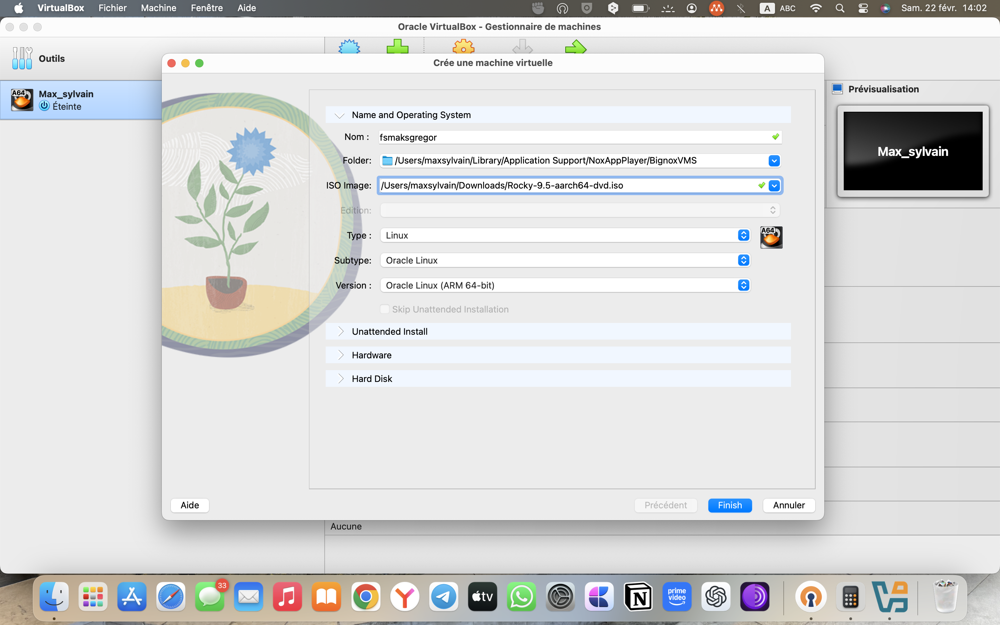{#fig:001 width=70%}

Укажите имя виртуальной машины (ваш логин в дисплейном классе), тип
операционной системы — Linux, RedHat (64-bit)
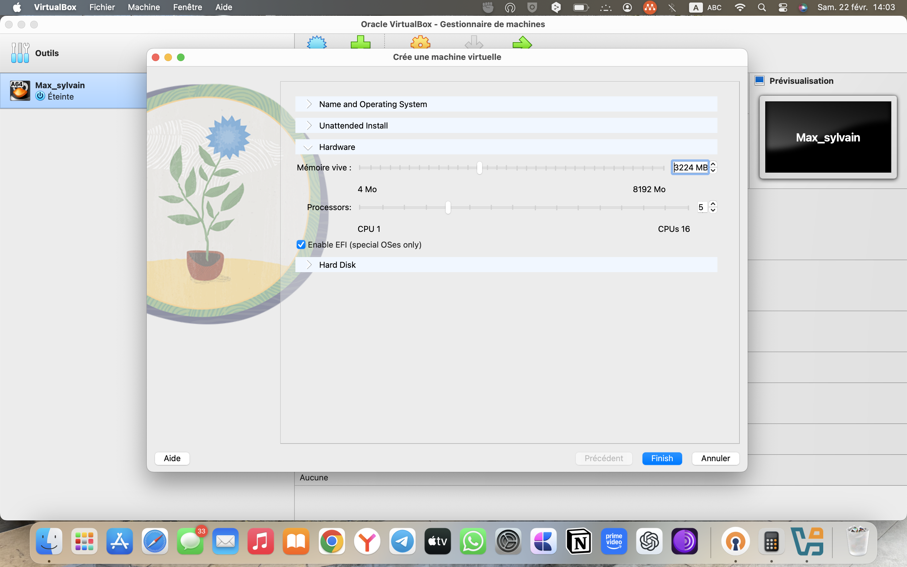{#fig:001 width=70%}
Укажите размер основной памяти виртуальной машины — 2048

Задайте конфигурацию жёсткого диска — загрузочный,VDI (BirtualBox
8DiskImage), динамический виртуальный диск Выберите в VirtualBox для Вашей
виртуальной машины Настройки Носители . Добавьте новый привод оптических
дисков и выберите образ операционной системы, например для работающих
в дисплейных классах /afs/dk.sci.pfu.edu.ru/common/files/iso/Rocky-номер_вер-
сии.iso

При необходимости скорректируйте часовой пояс, раскладку клавиатуры(ре-
комендуется добавить русский язык, но в качестве языка по умолчанию ука-
зать английский язык; задать комбинацию клавиш для переключения между
раскладками клавиатуры — например Alt + Shift ). В разделе выбора программ
укажите в качестве базового окружения Server with GUI , а в качестве дополнения
— Development Tools. Отключите KDUMP

Включите сетевое соединение и в качестве имени узла укажите user.localdomain
где вместо user укажите имя своего пользователя в соответствии с соглашением
об именовании. Установите пароль для root и пользователя с правами админи-
стратора

Установка имени пользователя и названия хост. Если при установке виртуаль-
ной машины вы задали имя пользователя или имя хоста, не удовлетворяющее
соглашению об именовании, то вам необходимо исправить это.
1. Запустите виртуальную машину и залогиньтесь.
{#fig:001 width=70%}
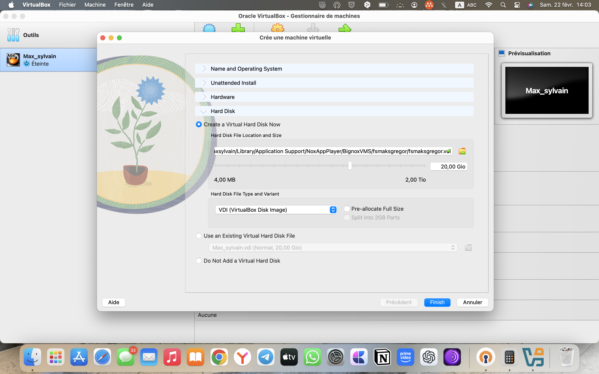{#fig:001 width=70%}
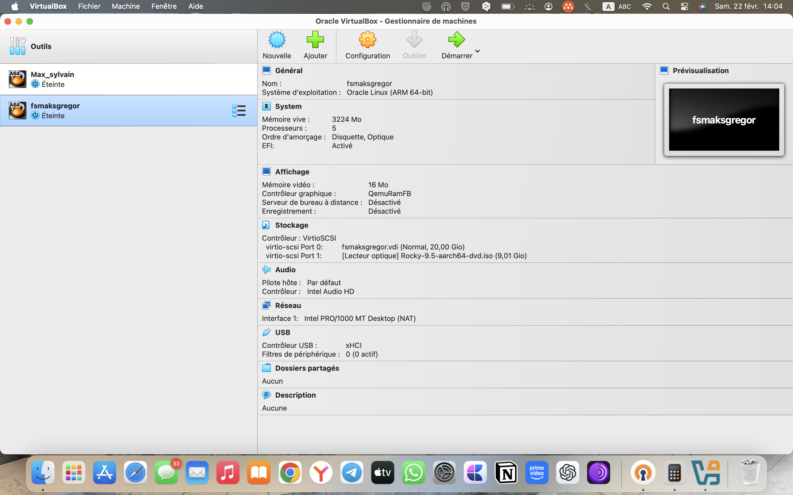{#fig:001 width=70%}
{#fig:001 width=70%}
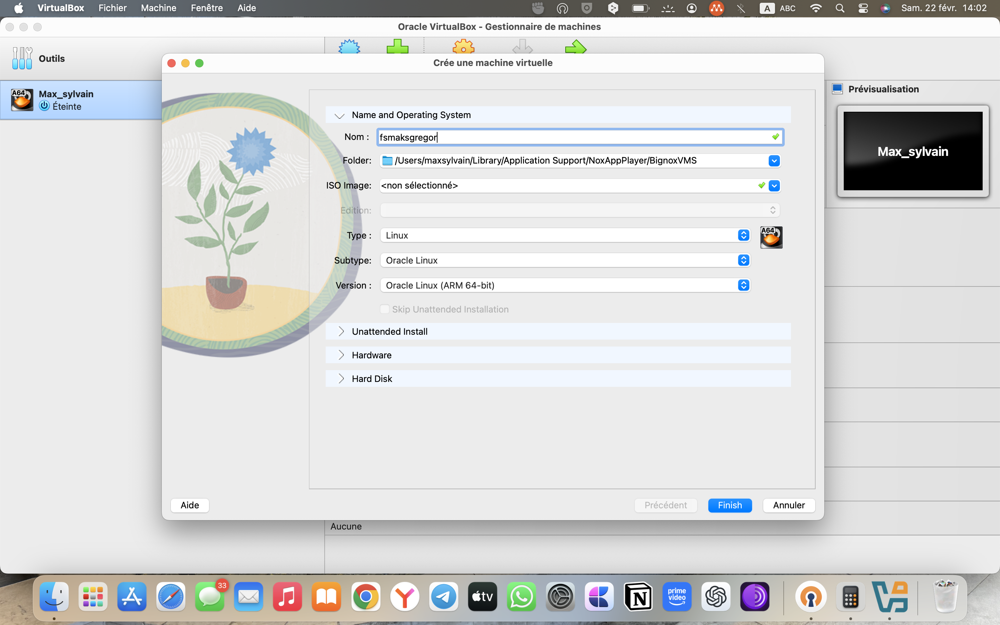{#fig:001 width=70%}
{#fig:001 width=70%}
{#fig:001 width=70%}
{#fig:001 width=70%}
{#fig:001 width=70%}
{#fig:001 width=70%}
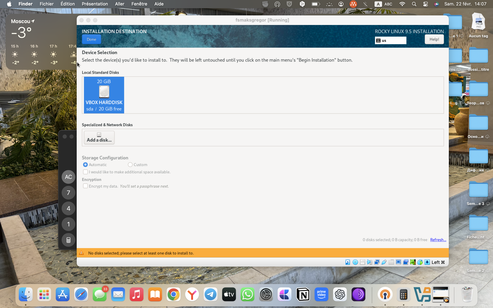{#fig:001 width=70%}
{#fig:001 width=70%}
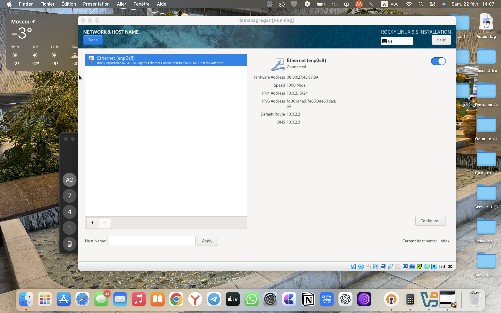{#fig:001 width=70%}
{#fig:001 width=70%}
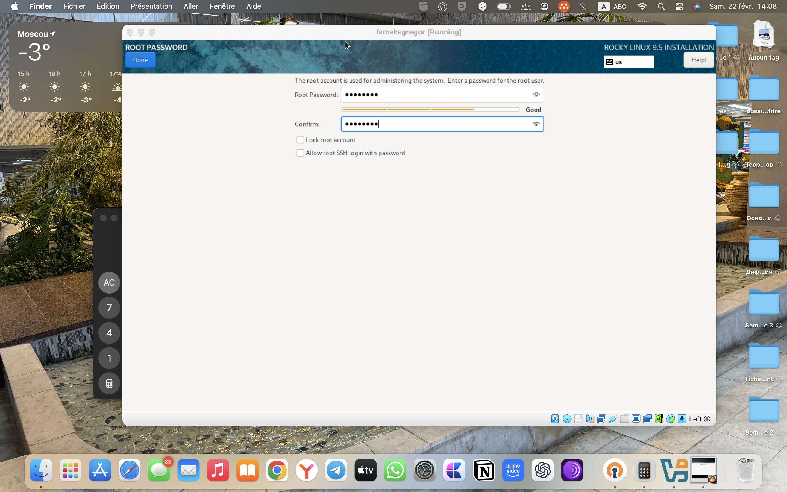{#fig:001 width=70%}
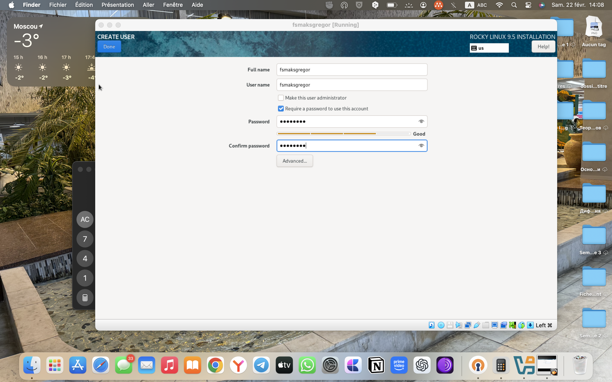{#fig:001 width=70%}
{#fig:001 width=70%}
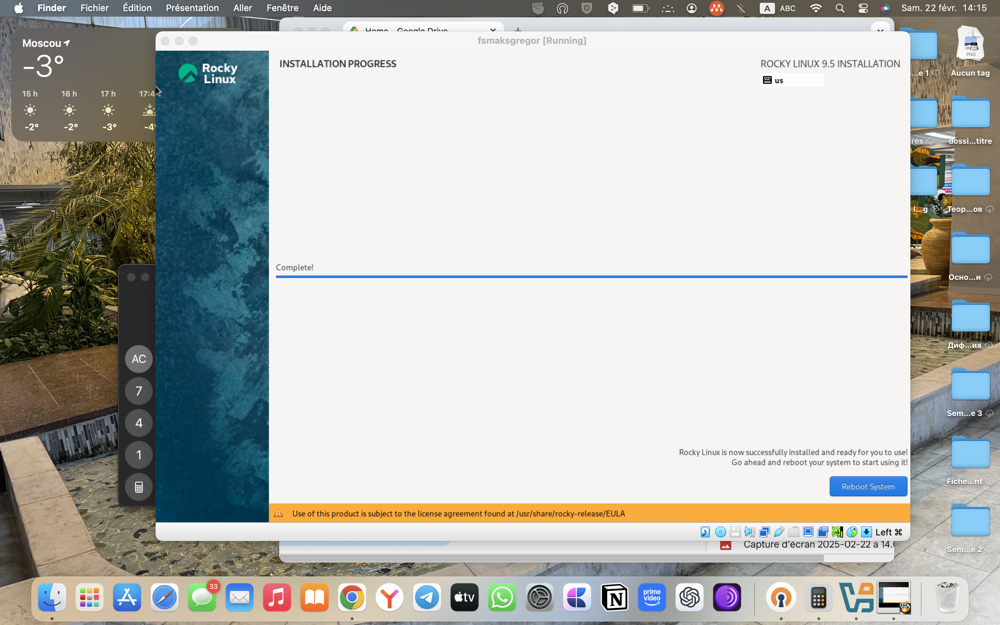{#fig:001 width=70%}
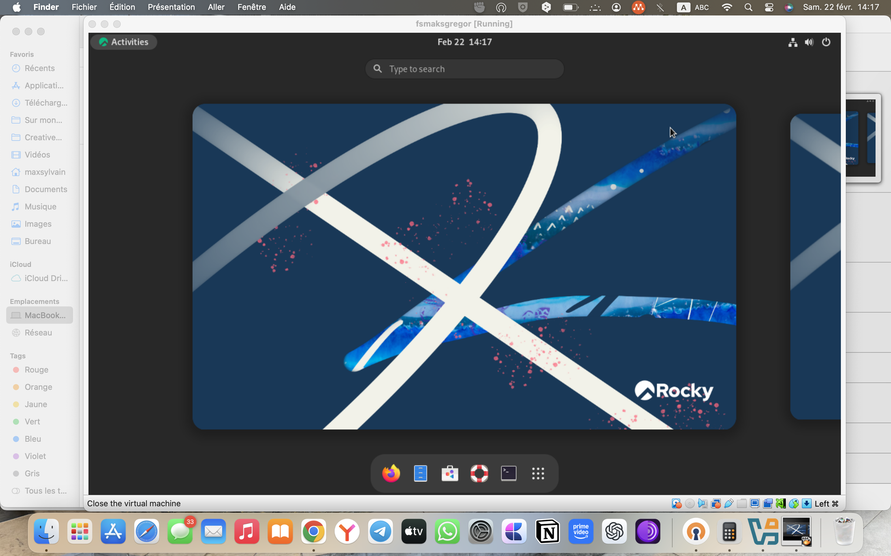{#fig:001 width=70%}
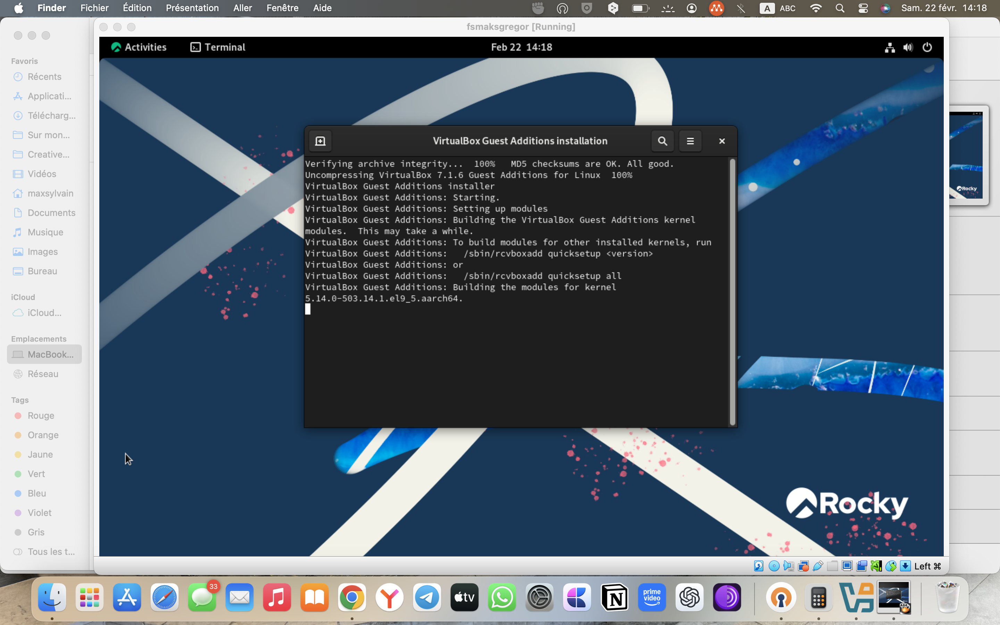{#fig:001 width=70%}

# 4 Домашнее задание

Дождитесь загрузки графического окружения и откройте терминал. В окне
терминала проанализируйте последовательность загрузки системы, выполнив
команду dmesg. Можно просто просмотреть вывод этой команды: dmesg | grep -i
“то, что ищем”
Получите следующую информацию. 1. Версия ядра Linux (Linux version). 2. Ча-
стота процессора (Detected Mhz processor). 3. Модель процессора (CPU0). 4. Объем
доступной оперативной памяти (Memory available). 5. Тип обнаруженного ги-
первизора (Hypervisor detected). 6. Тип файловой системы корневого раздела. 20
Кулябов Д. С., Королькова А. В., Геворкян М. Н. 7. Последовательность монтирова-
ния файловых систем.
{#fig:001 width=70%}

# Выводы

Я приобрел практические навыки по установке операционной системы на
виртуальную машину, настройке минимально необходимых для дальнейшей
работы сервисов.

#6 Контрольные вопросы

1. Информация в учетной записи пользователя:
• Имя пользователя (username)
• Домашний каталог (home directory)
• Идентификатор пользователя (user ID)
• Идентификатор группы (group ID)
• Шелл (программа командной оболочки, shell)
• Права доступа (permissions) к файлам и директориям
2. Команды терминала:
• Для получения справки по команде: man [команда] (например, man
ls)
• Для перемещения по файловой системе: cd [путь] (например, cd
/home/user)
• Для просмотра содержимого каталога: ls (например, ls -l для более
подробного списка)
• Для определения объёма каталога: du -h [каталог] (например, du -h
/home/user/documents)
• Для создания каталогов / файлов: mkdir [название], touch
[название] (например, mkdir new_directory, touch new_file.txt)
• Для удаления каталогов / файлов: rm -r [название] (например, rm -r
old_directory, rm file.txt)
• Для задания определённых прав: chmod [права] [файл] (например,chmod 755 script.sh)
• Для просмотра истории команд: history
3. Файловая система: Файловая система - это метод организации, хранения и
управления файлами и данными на устройстве хранения данных (например,
жестком диске). Примеры:
• FAT32 (File Allocation Table): Простая и старая файловая система,
поддерживаемая многими операционными системами.
• NTFS (New Technology File System): Разработана Microsoft, обеспечи-
вает расширенные функции и безопасность.
• EXT4 (Fourth Extended Filesystem): Распространенная в Linux, под-
держивает большие объемы данных и хранит метаданные.
4. Просмотр подмонтированных файловых систем: Используйте коман-
ду df -h для отображения информации о подмонтированных файловых
системах.
5. Удаление зависшего процесса: Используйте команду kill с номером
процесса (PID). Например, kill -9 PID, где PID - идентификатор процесса.
Если вы не знаете PID, используйте команду ps для просмотра активных
процессов, а затем примените kill.

# Список литературы{.unnumbered}

::: {#refs}
:::
